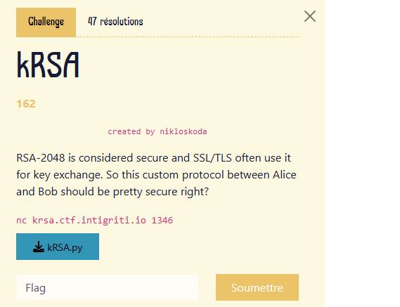

# Retour d’expérience : création d'un challenge CTF en cryptographie pour INTIGRITI - 1337UP LIVE CTF

Pour le [CTF annuel d'INTIGRITI](https://ctf.intigriti.io/), les organisateurs ont sollicité la communauté pour proposer des challenges originaux. Nicolas Duhamel, étudiant en B2 Cybersécurité à La Plateforme, a décidé de relever ce défi. Il s'est tourné vers la cryptographie, son domaine de prédilection, pour concevoir son premier challenge CTF.

## Les coulisses de la création d’un challenge en cryptographie

La création d’un challenge en cryptographie commence par l’imagination d’un problème, une sorte de puzzle, que les participants devront résoudre. Ce problème doit être équilibré : ni trop difficile, pour rester accessible, ni trop simple, afin de départager les compétences des joueurs. Dans un premier temps, une description succincte du problème et de sa solution est soumise aux organisateurs, qui décident si le challenge sera intégré au CTF.

Une fois validé, commence la phase de conception. Les challenges cryptographiques se déclinent généralement en deux types : statiques et dynamiques. Les challenges statiques consistent à fournir des fichiers (texte, binaire) à déchiffrer, tandis que les challenges dynamiques impliquent souvent un serveur interactif et le code source associé. Pour ces derniers, l’utilisation de conteneurs (via Docker Compose, par exemple) facilite leur déploiement. Cette étape est essentielle pour garantir une expérience fluide, mais elle sera laissée de côté ici pour nous concentrer sur l’essentiel : la conception du problème.

## La cryptographie expliquée simplement : principes et applications

La cryptographie joue un rôle essentiel dans notre vie quotidienne, souvent sans que nous en soyons conscients. Des paiements en ligne aux messages instantanés, elle assure que vos données restent confidentielles et protégées contre les altérations. Son objectif principal est de convertir des informations lisibles (texte clair) en un format illisible (texte chiffré) à l’aide d’algorithmes et de clés, accessibles uniquement aux personnes autorisées. Ainsi, même si un tiers intercepte les données, il ne pourra pas les comprendre sans la clé appropriée.

La cryptographie repose sur deux grandes techniques : le [chiffrement symétrique](https://fr.wikipedia.org/wiki/Cryptographie_sym%C3%A9trique) et le [chiffrement asymétrique](https://fr.wikipedia.org/wiki/Cryptographie_asym%C3%A9trique). Dans le chiffrement symétrique, une seule clé est utilisée à la fois pour chiffrer et déchiffrer les données, ce qui nécessite un échange sécurisé de cette clé entre les parties. À l’inverse, le chiffrement asymétrique repose sur une paire de clés : une clé publique pour chiffrer les données et une clé privée pour les déchiffrer.

Dans le cas du chiffrement symétrique, un problème pratique se pose : comment partager la clé commune en toute sécurité ? Pour résoudre ce défi, plusieurs protocoles ont été développés, parmi lesquels l’algorithme [Diffie-Hellman](https://fr.wikipedia.org/wiki/%C3%89change_de_cl%C3%A9s_Diffie-Hellman), l’un des plus célèbres. Ce protocole permet à deux parties d’établir une clé secrète commune, même si leurs communications sont interceptées.

## Zoom sur le défi : analyser un protocole d’échange de clé non sécurisé

Le challenge proposé porte sur un protocole d’échange de clé non standard. Ce dernier n’est pas sécurisé, mais encore faut-il être capable de comprendre pourquoi. Basé sur le [chiffrement RSA](https://fr.wikipedia.org/wiki/Chiffrement_RSA) – un algorithme inventé par Rivest, Shamir et Adleman – ce protocole semble à première vue robuste, puisque RSA est largement utilisé et réputé. Pourtant, l’utilisation d’un chiffrement sûr ne garantit pas toujours la sécurité d’un protocole entier. Ici, RSA est implémenté de manière naïve, rendant l’échange vulnérable à une attaque classique.

Dans la pratique, la sécurité d’un protocole repose souvent sur la longueur de sa clé, exprimée en bits, qui détermine sa résistance au bruteforce (test de toutes les clés possibles). Bien que la clé utilisée ici soit de 32 bits, un bruteforce naïf prendrait plus de temps que les 5 minutes imposées par le challenge. La solution passe alors par une attaque optimisée, dite "[meet in the middle](https://en.wikipedia.org/wiki/Meet-in-the-middle_attack)", qui consiste à diviser la clé en deux parties à brute-forcer séparément. Cela réduit la complexité à deux bruteforces de 16 bits, réalisables dans le délai imparti. On fait ici l'hypothèse que l'on peut diviser la clé en deux facteurs de 16 bits. Cela n'est pas toujours vrai, mais cela reste vrai avec une probabilité d'environ 20 %. Autrement dit, cette attaque fonctionne environ 1 fois sur 5, ce qui est largement suffisant pour compromettre la sécurité du protocole.

Nous mettons à disposition, pour ceux d'entre vous ayant des compétences en programmation, le code du serveur ainsi que celui de la résolution du challenge :
[code serveur](https://gist.github.com/nicolas-duhamel/90a9cfc41fdde2796e174041fd49b7a5), 
[code solution](https://gist.github.com/nicolas-duhamel/87f70081c14070aab889f26f66844c2a).

## La timeline et une anecdote

Tout le processus de création du challenge a duré plusieurs mois. Après l’appel initial lancé aux auteurs de challenges, un premier mois s’est écoulé entre la soumission d’une proposition succincte et son acceptation par les organisateurs. Une fois cette étape franchie, viens l’écriture du code du challenge en Python ainsi que de sa solution, afin de prouver que le problème était résoluble dans les conditions imposées. Cette phase a été suivie par quelques échanges avec les organisateurs pour ajuster l’intégration et le déploiement. Une partie de ces discussions portait sur l'intégration via Docker Compose, qui facilite le déploiement des serveurs pendant le CTF. Finalement, le challenge était prêt environ trois semaines avant le jour J.

Cependant, à quelques jours seulement du CTF, un coup de stress énorme : le challenge pourrait être vulnérable à une autre attaque classique, connue sous le nom d’[attaque de Coppersmith](https://en.wikipedia.org/wiki/Coppersmith%27s_attack). Si cette attaque avait été applicable, elle aurait réduit l’intérêt du challenge en le rendant trop facile à résoudre. Par un heureux hasard, la clé publique choisie rendait cette attaque impraticable sur un ordinateur de bureau classique. Dans tous les cas, une simple modification dans le code aurait suffi à neutraliser l’attaque.

Ces solutions "unintended" (non prévues) sont souvent un cauchemar pour les auteurs de challenges, car elles peuvent réduire, voire totalement annihiler, l’intérêt du challenge. Il n’est pas rare de voir, pendant un CTF, des challenges "revenge" apparaître : il s’agit de corrections rapides des failles imprévues qui rend le challenge initial trop facile. Ces ajustements de dernière minute, bien qu’essentiels, rappellent l’importance de tester rigoureusement un problème sous tous les angles.

## Conclusion

Ce challenge illustre à quel point la cryptographie est un domaine subtil. Concevoir des protocoles robustes demande non seulement des connaissances solides, mais aussi une expertise pratique. Écrire un challenge pour un CTF est une expérience unique, exigeante mais enrichissante. Cela pousse à approfondir ses compétences, à imaginer des problèmes réalistes et à penser comme un attaquant pour anticiper les stratégies des participants.

Ce retour d'expérience montre également l'importance d’équilibrer difficulté et pédagogie : il s’agit non seulement de proposer un défi technique, mais aussi d'offrir un apprentissage concret à ceux qui s’y confrontent. Si vous souhaitez vous lancer dans la conception de challenges, prenez le temps de valider vos idées et de tester vos concepts, similaire à l'étape de bêta test pour les jeux vidéos. Et surtout, rappelez-vous qu’en matière de sécurité, chaque détail compte – d’où l’importance de faire appel à des experts pour garantir la solidité des systèmes.

Si vous avez testé le challenge ou souhaitez partager votre expérience, n’hésitez pas à contacter l'auteur : [nicolas.duhamel@laplateforme.io](mailto:nicolas.duhamel@laplateforme.io).

Rédacteur : Nicolas Duhamel,
Etudiant B2 Cybersécurité à LaPlateforme_

Crédits photo : Wikipédia