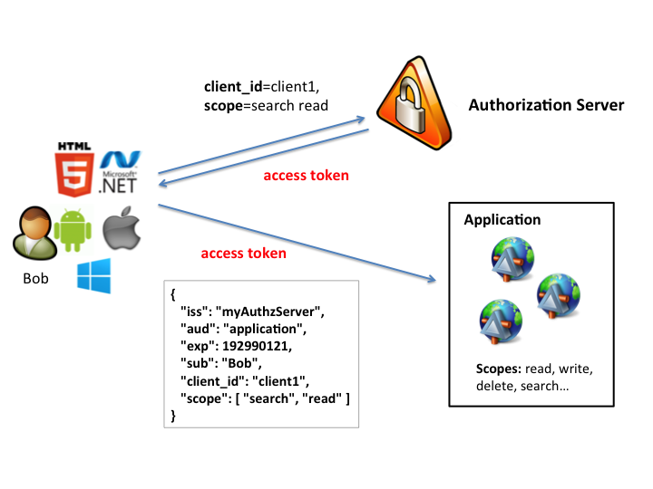
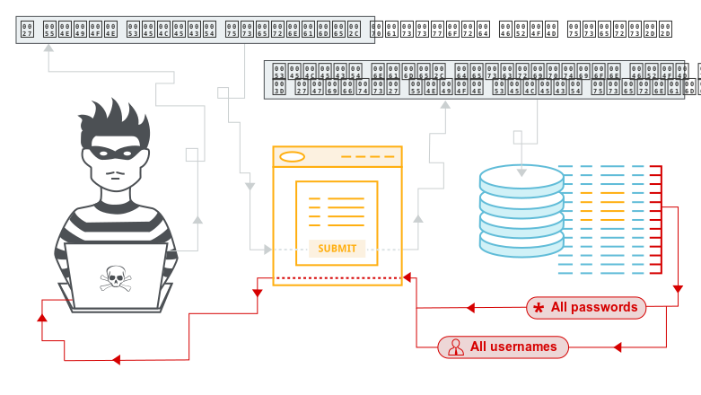
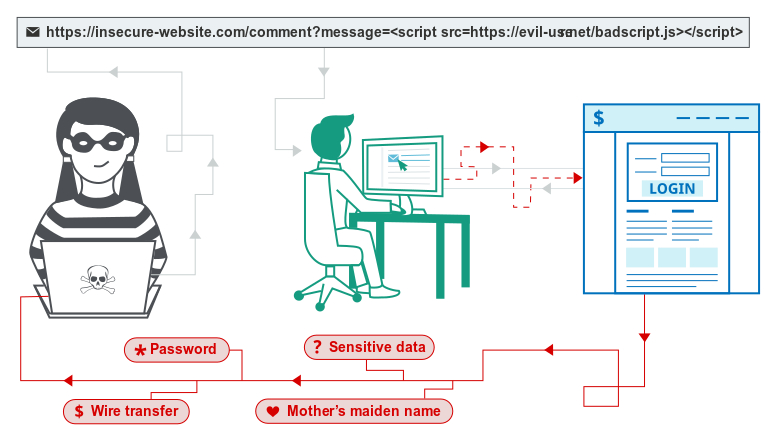
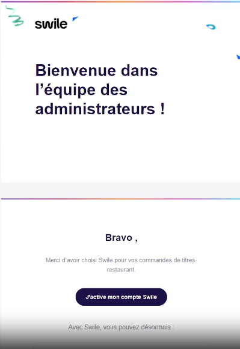

# Chasser les failles, protéger le web : dans les coulisses du bug bounty

Bonjour, je m'appelle Benjamin Mamoud, étudiant à La Plateforme. Passionné de cybersécurité, j’ai découvert ce domaine assez tôt. Fasciné par les nouvelles technologies et leur fonctionnement, je me suis naturellement tourné vers le pentest, en me formant sur des plateformes de CTF comme Root-Me. Depuis, je ne cesse de progresser et d’en apprendre davantage chaque jour.

## Et si je vous disais qu’on pouvait être payé pour pirater des sites… légalement ?

C’est là qu’intervient le bug bounty, ou "prime à la faille". Ce programme, mis en place par des entreprises, consiste à inviter des hackers éthiques à tester leurs systèmes à la recherche de vulnérabilités. Plutôt que d’attendre qu’un cybercriminel exploite une faille, elles préfèrent qu’un chercheur la découvre en amont et le récompensent pour cela.

Une approche intelligente, collaborative, et surtout essentielle pour renforcer la sécurité du web, tout en valorisant les compétences des passionnés de cybersécurité.

## Les vulnérabilités

Pour performer en bug bounty, il est essentiel de connaître la majorité des vulnérabilités qui s'appliquent aux applications web. Un bon point de départ est le **OWASP Top 10**, qui regroupe les 10 types de vulnérabilités les plus répandues sur les sites web. C’est sur ce type de failles que je concentre mes efforts, me spécialisant particulièrement dans le pentest d’applications web.

## Ma découverte du monde des bug bountys

C’était en janvier 2020. Fatigué par une nuit trop courte, j’ai opté pour la facilité : commander à manger sur Uber Eats. En tentant de me connecter, je ne reçois pas le code de vérification par SMS. Curieux, j’ouvre les Devtools de Chrome pour analyser les requêtes.

Je m’attarde sur la requête censée m’envoyer ce code : rien d’anormal, une réponse classique avec un identifiant `inAuthSessionID`. En allant sur la page support d’Uber, je remarque qu’une nouvelle session est générée via une redirection. Sur un coup de tête, je remplace le cookie `sessionid` par la valeur de `inAuthSessionID`.

Erreur. Mais en revenant sur le site… me voilà connecté.

Je tente à nouveau sur un autre compte, et je réalise que je peux me connecter sur n’importe quel compte, sans mot de passe ni code SMS.

OAuth est un protocole d'autorisation qui permet à une application d'accéder à des ressources d’un utilisateur sans avoir besoin de son mot de passe (en passant par un code reçu par sms sur Uber). L’utilisateur approuve un accès limité (défini par des "scopes") à ses données via un jeton d’accès.

La vulnérabilité venait d’une mauvaise gestion de ce protocole. Uber ne vérifiait pas correctement les "scopes" (permissions) associés aux jetons. J’avais ainsi accès à plus de données que prévu.

Un ami dans la cybersécurité me parle alors des programmes de bug bounty. J’envoie un rapport à Uber, et quelques semaines plus tard, je reçois une récompense. Une révélation : je décide de me lancer sérieusement dans le signalement de failles.

## Cairn.info – Comment une simple requête SQL sur un sous-domaine a mené à un accès total

Je visitais régulièrement Cairn.info pour ses publications scientifiques, et j’ai décidé de tester sa sécurité.

En énumérant les sous-domaines (`*.cairn.info`), l’un d’eux attire mon attention. En bruteforçant les ressources, je tombe sur un panneau d’administration. En testant le formulaire de connexion, je détecte une **injection SQL**.

L’injection SQL permet d’envoyer du code malveillant dans une requête à la base de données. Cela permet de lire, modifier, ou supprimer des données sensibles.

Grâce à cette faille, je pouvais exécuter n’importe quelle requête SQL. En allant plus loin, j’ai utilisé la commande `system` pour exécuter des commandes système et obtenir un accès complet à l’infrastructure.

J’ai immédiatement signalé la vulnérabilité à l’équipe de Cairn, qui m’a félicité pour la découverte.

## La Poste – Une vulnérabilité de type Cross-Site Scripting (XSS)

L'**injection XSS** permet d’injecter du code JavaScript dans une page web. Ce script s’exécute sur le navigateur d’un utilisateur, ce qui peut permettre à un attaquant de voler des cookies ou modifier le contenu de la page.

En naviguant sur le site de La Poste, je tombe sur une page listant les vendeurs. L’URL est de type : http://laposte/vendeur/la-poste/0000

En modifiant "la-poste" par "la-poste-abcdef", je remarque que le texte est repris dans le HTML de la page. J’essaie donc cette URL :

http://laposte/vendeur/la-poste"></script>alert(document.cookie)</script><!--/0000

Bingo : une alerte s’affiche avec mes cookies.

Un script malveillant aurait pu les exfiltrer, permettant de pirater des comptes.

## Swile – Account Takeover : des millions d’euros de tickets restaurant en jeu

Lors d’un test sur **Swile**, une solution de titres-restaurants utilisée par des entreprises comme Decathlon, SNCF ou MaFrenchBank, je découvre une vulnérabilité critique.

Lors de l’inscription en tant qu’employeur, il suffit d’indiquer un **SIRET**. Le site vérifie si ce SIRET est déjà enregistré, puis génère une requête de création de compte.

En contournant cette vérification, j’ai pu forger cette requête moi-même et m’inscrire avec n’importe quel email… même si l’entreprise existait déjà.

J’accédais ainsi à l’interface administrateur de n’importe quelle entreprise.

Je n’ai évidemment rien exploité et ai immédiatement signalé la faille.

## Des failles, mais surtout des leçons

À travers ces expériences, j’ai compris que la cybersécurité ne consiste pas seulement à chercher des bugs. C’est une discipline qui demande rigueur, curiosité, méthode… mais aussi éthique.

Chaque faille est une opportunité d’apprentissage. Et chaque signalement contribue à rendre le web plus sûr pour tous.

Aujourd’hui, je continue à progresser dans cet univers fascinant, en espérant un jour faire de la cybersécurité mon métier à plein temps.

---

*Merci de m’avoir lu ! N’hésitez pas à me contacter ou à échanger si vous avez des questions sur le bug bounty ou la cybersécurité en général.*
